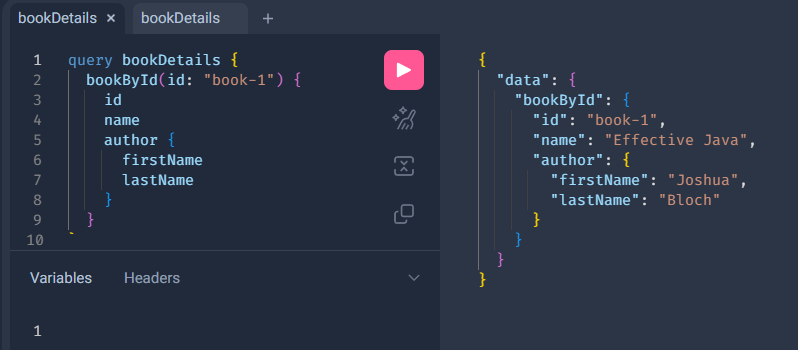

# Spring for GraphQL

GraphQL is a query language to retrieve data from a server. It is an alternative to REST, SOAP, or gRPC.

## Project overview

This project is a demo implementation for Spring GraphQL: a simple API to get details for a specific book.

The application is available at: http://localhost:8080/graphiql

Using below query, you should see a response like this:

```
query bookDetails {
  bookById(id: "book-1") {
    id
    name
    author {
      firstName
      lastName
    }
  }
}
```

